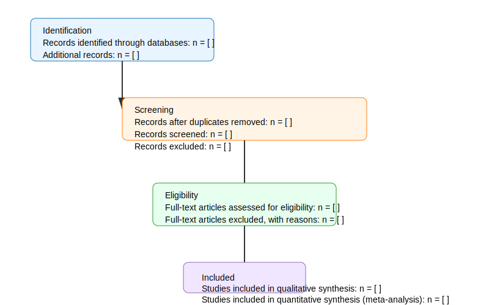

# Title

[Insert full title here]

## Abstract

[Structured abstract: Background; Objective(s); Methods; Results; Conclusions]

## Keywords

[keyword1, keyword2, ...]

## 1. Introduction

[Background and rationale]

## 2. Research Questions

- RQ1: [state question]
- RQ2: [state question]

## 3. Methods

### 3.1 Search strategy

- Databases searched: [e.g., Scopus, Web of Science, IEEE Xplore]
- Search terms / string: "[your search string]"
- Date range: [start — end]

### 3.2 Inclusion and exclusion criteria

- Inclusion: [e.g., peer-reviewed, English, years]
- Exclusion: [e.g., non-original research, abstracts]

### 3.3 Study selection

- Screening process: title/abstract screening, full-text review
- Number of reviewers: [e.g., two independent reviewers]

### 3.4 Data extraction

- Data items: author, year, country, study design, sample, outcomes, key findings

### 3.5 Quality assessment

- Tool used: [e.g., CASP, RoB, Newcastle–Ottawa Scale]

## 4. Results

### 4.1 Study selection

Refer to the PRISMA flow diagram below.



### 4.2 Study characteristics

Use the table template below to summarise included studies.

| Study | Year | Design | Sample Size | Intervention / Exposure | Outcome(s) | Key Findings |
|---|---:|---|---:|---|---|---|
| ... | ... | ... | ... | ... | ... | ... |

### 4.3 Synthesis of results

- Narrative synthesis grouped by theme/topic
- Optionally: quantitative synthesis / meta-analysis

## 5. Discussion

- Summary of main findings
- Strengths and limitations of the review
- Implications for practice and research

## 6. Conclusion

[Brief concluding statements addressing the RQs]

## 7. References

[Use numbered or author-year style. Maintain consistent citation format.]

---

## Appendix A — Data extraction table (extended)

| ID | Author | Year | Country | Design | Sample | Measures | Results | Quality score |
|---|---|---:|---|---|---:|---|---|---:|
| 1 | ... | ... | ... | ... | ... | ... | ... | ... |


## How to export to PDF

If you have `pandoc` and a TeX engine installed, run (PowerShell):

```powershell
pandoc "pdfs/SLR_Template.md" -o "pdfs/SLR_Template.pdf" --pdf-engine=xelatex
```

Or use any Markdown-to-PDF tool or copy the content into Word/Google Docs and export as PDF.


## Notes

- Replace placeholder text with your review content.
- Update the PRISMA SVG (`PRISMA_flow.svg`) if you need different numbers or shapes.
